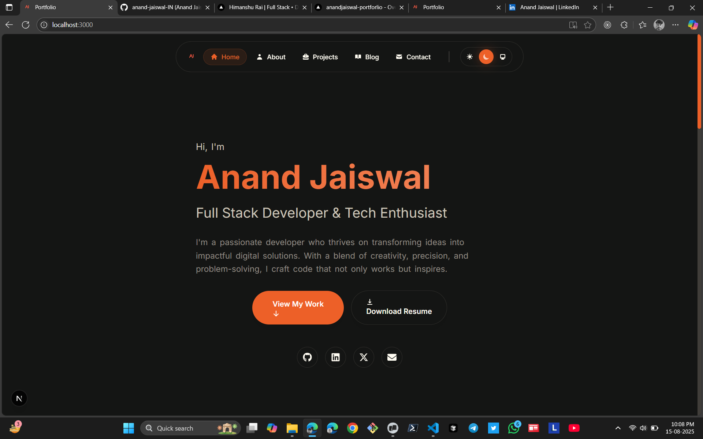
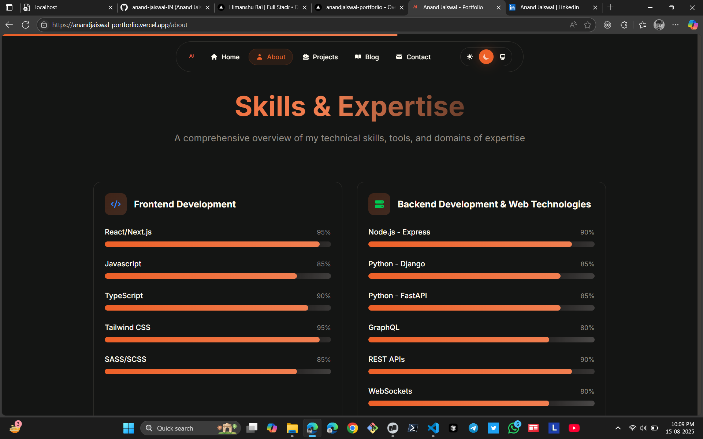
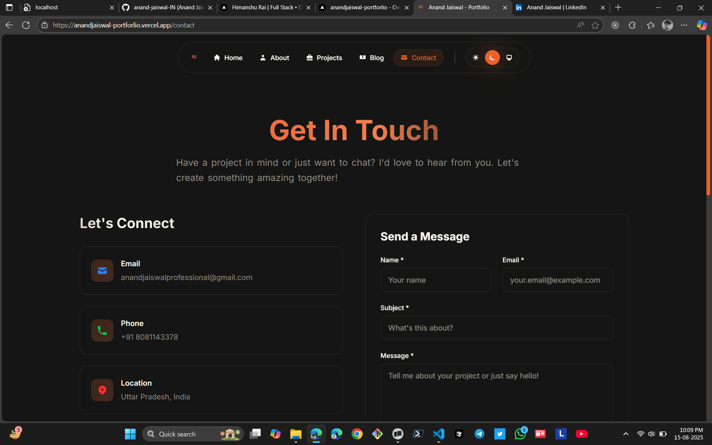
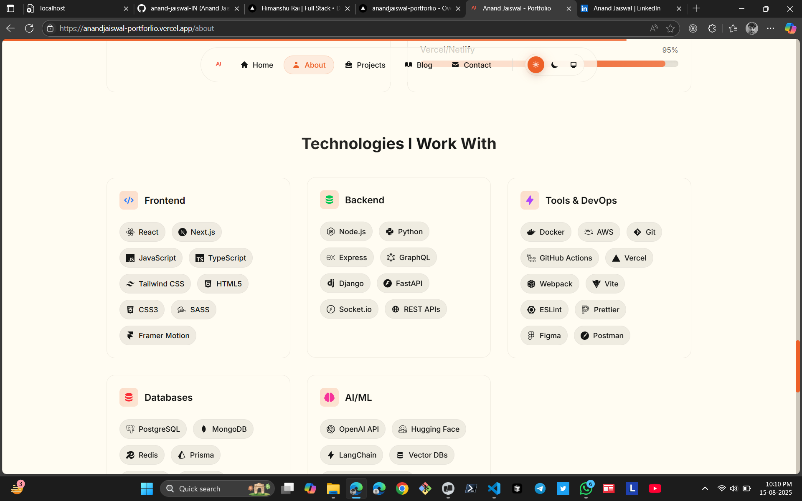
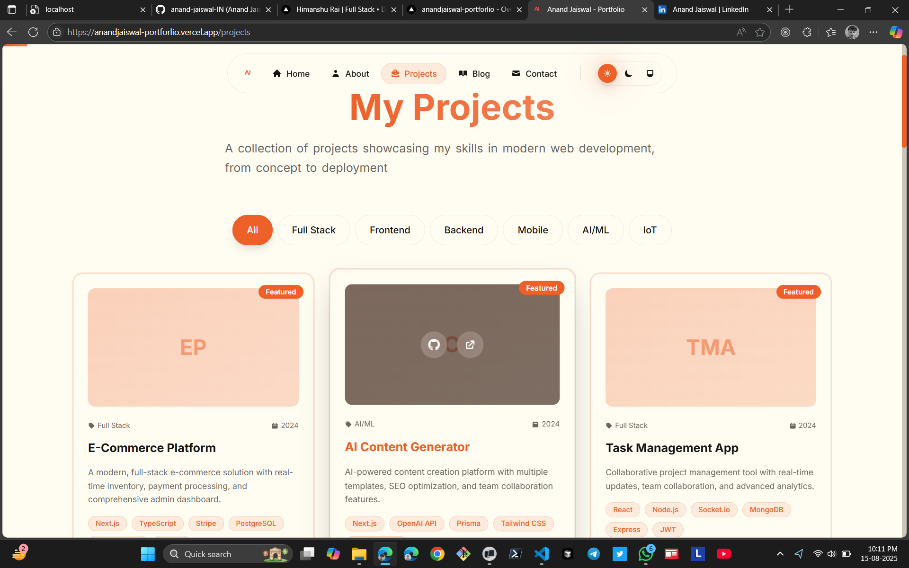

# 🚀 Anand Jaiswal - Modern Portfolio Website

<div align="center">



**A stunning, modern developer portfolio website built with Next.js 15, featuring dynamic animations, glassmorphism design, and a comprehensive blog system.**

[](https://nextjs.org/)
[](https://www.typescriptlang.org/)
[](https://tailwindcss.com/)
[](https://www.framer.com/motion/)

[🌐 Live Demo](https://anandjaiswal.dev) • [📖 Documentation](#-documentation) • [🚀 Quick Start](#-quick-start)

</div>

---

## 📸 Screenshots

<div align="center">

### 🏠 Homepage


### 👨‍💻 About Page


### 💼 Projects Showcase


### 📝 Blog System


### 📱 Mobile Responsive


</div>

---

## ✨ Features

### 🎨 **Design & User Experience**
- 🌟 **Modern Glassmorphism & Neumorphism** effects
- 🎭 **Dynamic Animations** with Framer Motion
- 🌊 **Parallax Effects** for immersive scrolling experience
- 🎯 **Creative Grids & Layouts** with asymmetric designs
- 📱 **Fully Responsive** design optimized for all devices
- 🌓 **Dark/Light/System Theme** toggle with smooth transitions
- 🎨 **Orange Color Scheme** with professional gradients

### 🚀 **Pages & Sections**
- 🏠 **Homepage** - Hero section, skills preview, and featured projects
- 👨‍💻 **About Page** - Personal story, timeline, detailed skills, and statistics
- 💼 **Projects Page** - Interactive project showcase with filtering
- 📝 **Blog System** - Comprehensive blog with markdown support
- 📞 **Contact Page** - Professional contact form with social links
- 🧭 **Navigation** - Responsive navigation with mobile hamburger menu

### 🛠️ **Technical Features**
- ⚡ **Next.js 15** with App Router and React 19
- 🔷 **TypeScript** for complete type safety
- 🎨 **Tailwind CSS v4** for modern styling
- 🎬 **Framer Motion v12** for smooth animations
- 🎯 **React Icons** for consistent iconography
- 📝 **Markdown Blog** system with gray-matter
- 🚀 **Performance Optimized** with lazy loading
- 🔍 **SEO Optimized** with proper meta tags
- 🧹 **ESLint & Prettier** for code quality
- 📦 **Bun** for fast package management

---

## 🎯 Design Philosophy

This portfolio embodies cutting-edge web design principles:

### 🎨 **Visual Design**
- **Glassmorphism**: Translucent elements with backdrop blur effects
- **Neumorphism**: Soft, extruded design elements for depth
- **Dynamic Animations**: Smooth, purposeful animations that enhance UX
- **Parallax Effects**: Subtle depth and movement for visual interest
- **Creative Layouts**: Asymmetric grids and floating elements

### 🎭 **User Experience**
- **Micro-interactions**: Hover effects and button animations
- **Smooth Transitions**: Page transitions and loading states
- **Responsive Design**: Mobile-first approach with breakpoints
- **Accessibility**: Proper contrast ratios and keyboard navigation
- **Performance**: Optimized loading and smooth 60fps animations

---

## 🚀 Quick Start

### 📋 **Prerequisites**
- **Node.js** 18+ or **Bun** (recommended)
- **Git** for version control

### ⚡ **Installation**

1. **Clone the repository:**
```bash
git clone https://github.com/anandjaiswal/portfolio.git
cd anandjaiswal_portforlio
```

2. **Install dependencies:**
```bash
# Using Bun (recommended)
bun install

# Using npm
npm install

# Using yarn
yarn install
```

3. **Start development server:**
```bash
# Using Bun
bun dev

# Using npm
npm run dev

# Using yarn
yarn dev
```

4. **Open in browser:**
   - Navigate to [http://localhost:3000](http://localhost:3000)
   - The site will automatically reload when you make changes

### 🛠️ **Available Scripts**

```bash
bun dev          # Start development server with Turbopack
bun build        # Build for production
bun start        # Start production server
bun lint         # Run ESLint
bun lint:fix     # Fix ESLint errors automatically
bun format       # Format code with Prettier
bun format:check # Check code formatting
```

---

## 📁 Project Structure

```
📦 anandjaiswal_portforlio/
├── 📂 app/                          # Next.js 15 App Router
│   ├── 📂 about/                    # About page with skills & timeline
│   ├── 📂 blog/                     # Blog system with dynamic routes
│   │   └── 📂 [slug]/               # Dynamic blog post pages
│   ├── 📂 contact/                  # Contact page with form
│   ├── 📂 projects/                 # Projects showcase page
│   ├── 📄 globals.css               # Global styles & CSS variables
│   ├── 📄 layout.tsx                # Root layout with providers
│   └── 📄 page.tsx                  # Homepage
├── 📂 components/                   # Reusable React components
│   ├── 📂 sections/                 # Page sections
│   │   ├── 📄 hero.tsx              # Hero section with animations
│   │   ├── 📄 featured-projects.tsx # Featured projects showcase
│   │   ├── 📄 skills-preview.tsx    # Skills overview
│   │   └── 📄 skills-detailed.tsx   # Detailed skills with categories
│   ├── 📂 ui/                       # Reusable UI components
│   │   ├── 📄 animated-text.tsx     # Text animations
│   │   ├── 📄 floating-card.tsx     # Glassmorphism cards
│   │   ├── 📄 gradient-text.tsx     # Gradient text effects
│   │   ├── 📄 magnetic-button.tsx   # Interactive buttons
│   │   ├── 📄 parallax-section.tsx  # Parallax effects
│   │   ├── 📄 project-card.tsx      # Project showcase cards
│   │   ├── 📄 skill-bar.tsx         # Animated skill progress bars
│   │   ├── 📄 timeline.tsx          # Career timeline
│   │   └── 📄 ...                   # 20+ more UI components
│   ├── 📄 navigation.tsx            # Responsive navigation
│   ├── 📄 footer.tsx                # Footer component
│   ├── 📄 theme-provider.tsx        # Theme context provider
│   └── 📄 theme-toggle.tsx          # Dark/light mode toggle
├── 📂 content/                      # Markdown content
│   └── 📂 blog/                     # Blog posts (8 sample posts)
│       ├── 📄 getting-started-with-nextjs.md
│       ├── 📄 react-performance-optimization.md
│       ├── 📄 typescript-best-practices.md
│       └── 📄 ...                   # More blog posts
├── 📂 hooks/                        # Custom React hooks
│   ├── 📄 use-scroll-animation.ts   # Scroll-triggered animations
│   └── 📄 use-performance.ts        # Performance monitoring
├── 📂 lib/                          # Utility functions
│   ├── 📄 blog.ts                   # Blog processing utilities
│   └── 📄 utils.ts                  # General utilities
├── 📂 public/                       # Static assets
│   ├── 📄 logo.png                  # Site logo
│   ├── 📄 my_img.png                # Profile image
│   └── 📄 resume.pdf                # Resume file
├── 📂 screenshots/                  # Project screenshots
│   ├── 📄 1.png                     # Homepage screenshot
│   ├── 📄 2.png                     # About page screenshot
│   └── 📄 ...                       # More screenshots
├── 📄 eslint.config.js              # ESLint configuration
├── 📄 .prettierrc.json              # Prettier configuration
├── 📄 next.config.ts                # Next.js configuration
├── 📄 tailwind.config.js            # Tailwind CSS configuration
├── 📄 tsconfig.json                 # TypeScript configuration
└── 📄 package.json                  # Dependencies & scripts
```

---

## 📝 Content Management

### 📰 **Adding Blog Posts**

Create new blog posts by adding markdown files to the `content/blog/` directory:

```markdown
---
title: "Your Amazing Blog Post Title"
date: "2024-01-15"
excerpt: "A compelling description that will appear in the blog listing"
author: "Anand Jaiswal"
tags: ["Next.js", "React", "TypeScript", "Web Development"]
featured: true
---

# Your Blog Content

Write your blog content here using **markdown syntax**.

## Supported Features
- Code syntax highlighting
- Images and media
- Lists and tables
- Custom styling

```

### 💼 **Adding Projects**

Update the projects data in `app/projects/page.tsx`:

```typescript
const projects = [
  {
    title: "Your Project Name",
    description: "Brief project description",
    longDescription: "Detailed project description...",
    technologies: ["React", "Next.js", "TypeScript"],
    github: "https://github.com/username/project",
    live: "https://project-demo.com",
    date: "2024",
    category: "Full Stack",
    featured: true
  },
  // Add more projects...
]
```

### 🎨 **Customization Guide**

#### **Colors & Themes**
Edit CSS variables in `app/globals.css`:

```css
@theme {
  --color-primary: #ed6028;      /* Orange primary color */
  --color-accent: #f17f51;       /* Orange accent color */
  --color-success: #10b981;      /* Success green */
  --color-warning: #f59e0b;      /* Warning yellow */
  --color-error: #ef4444;        /* Error red */
}

/* Light theme */
:root {
  --background-primary: #fffcf2;
  --foreground-primary: #252422;
  /* Add your custom colors */
}

/* Dark theme */
[data-theme="dark"] {
  --background-primary: #141514;
  --foreground-primary: #fffcf2;
  /* Dark theme colors */
}
```

#### **Personal Information**
Update these key files:
- `components/sections/hero.tsx` - Hero section content
- `app/about/page.tsx` - About page information
- `components/navigation.tsx` - Navigation links
- `app/contact/page.tsx` - Contact information
- `public/` - Replace logo, images, and resume

---

## 🚀 Deployment

### 🌐 **Vercel (Recommended)**

The website is optimized for Vercel deployment:

1. **Push to GitHub:**
   ```bash
   git add .
   git commit -m "Initial commit"
   git push origin main
   ```

2. **Deploy on Vercel:**
   - Visit [vercel.com](https://vercel.com)
   - Import your GitHub repository
   - Deploy with zero configuration!

3. **Environment Variables (if needed):**
   ```bash
   NEXT_PUBLIC_SITE_URL=https://yourdomain.com
   ```

### 🏗️ **Other Platforms**

For other hosting platforms:

```bash
# Build the project
bun run build

# The output will be in the .next folder
# Upload the built files to your hosting provider
```

**Supported Platforms:**
- Netlify
- AWS Amplify
- Railway
- Render
- Any static hosting provider

---

## 📊 Performance Features

### ⚡ **Core Web Vitals Optimized**
- **Largest Contentful Paint (LCP)**: < 2.5s
- **First Input Delay (FID)**: < 100ms
- **Cumulative Layout Shift (CLS)**: < 0.1

### 🚀 **Performance Optimizations**
- ✅ **Next.js Image Optimization** with automatic WebP conversion
- ✅ **Lazy Loading** for animations and content
- ✅ **Code Splitting** automatic with Next.js App Router
- ✅ **Performance Monitoring** hooks for real-time metrics
- ✅ **Responsive Images** with multiple breakpoints
- ✅ **Font Optimization** with next/font
- ✅ **Bundle Analysis** for size optimization

### 📱 **Mobile Performance**
- ✅ **Mobile-First Design** approach
- ✅ **Touch-Friendly Interactions**
- ✅ **Optimized Animations** for mobile devices
- ✅ **Progressive Web App** ready

---

## 🔍 SEO & Analytics

### 🎯 **SEO Optimizations**
- ✅ **Meta Tags** optimized for search engines
- ✅ **Open Graph** tags for social media sharing
- ✅ **Twitter Cards** for Twitter sharing
- ✅ **Structured Data** (JSON-LD) for rich snippets
- ✅ **Sitemap Generation** (can be added)
- ✅ **Robots.txt** configuration
- ✅ **Fast Loading** for better search rankings

### 📈 **Analytics Ready**
```typescript
// Add to app/layout.tsx
import { Analytics } from '@vercel/analytics/react'

export default function RootLayout({ children }) {
  return (
    <html>
      <body>
        {children}
        <Analytics />
      </body>
    </html>
  )
}
```

---

## 🛠️ Tech Stack

### **Frontend**
- ⚛️ **React 19** - Latest React with concurrent features
- ⚡ **Next.js 15** - App Router with Turbopack
- 🔷 **TypeScript 5** - Type safety and developer experience
- 🎨 **Tailwind CSS v4** - Utility-first CSS framework
- 🎬 **Framer Motion 12** - Production-ready motion library

### **Development Tools**
- 📦 **Bun** - Fast JavaScript runtime and package manager
- 🧹 **ESLint** - Code linting and quality
- 💅 **Prettier** - Code formatting
- 🔧 **PostCSS** - CSS processing
- 📝 **Gray Matter** - Markdown frontmatter parsing

### **UI & Design**
- 🎯 **React Icons** - Comprehensive icon library
- 🌈 **Clsx** - Conditional className utility
- 🎨 **Tailwind Merge** - Merge Tailwind classes
- 🖼️ **Next.js Image** - Optimized image component

---

## 🤝 Contributing

We welcome contributions! Here's how you can help:

### **🐛 Bug Reports**
- Use the [issue tracker](https://github.com/anandjaiswal/portfolio/issues)
- Include screenshots and steps to reproduce
- Specify your browser and device

### **✨ Feature Requests**
- Open an issue with the "enhancement" label
- Describe the feature and its benefits
- Include mockups or examples if possible

### **🔧 Pull Requests**
1. Fork the repository
2. Create a feature branch: `git checkout -b feature/amazing-feature`
3. Commit changes: `git commit -m 'Add amazing feature'`
4. Push to branch: `git push origin feature/amazing-feature`
5. Open a Pull Request

### **📝 Code Style**
- Follow the existing code style
- Run `bun lint` and `bun format` before committing
- Write meaningful commit messages

---

## 📄 License

This project is open source and available under the [MIT License](LICENSE).

```
MIT License

Copyright (c) 2024 Anand Jaiswal

Permission is hereby granted, free of charge, to any person obtaining a copy
of this software and associated documentation files (the "Software"), to deal
in the Software without restriction, including without limitation the rights
to use, copy, modify, merge, publish, distribute, sublicense, and/or sell
copies of the Software, and to permit persons to whom the Software is
furnished to do so, subject to the following conditions:

The above copyright notice and this permission notice shall be included in all
copies or substantial portions of the Software.
```

---

## 🙏 Acknowledgments

Special thanks to the amazing open-source community:

- 🚀 **[Next.js Team](https://nextjs.org/)** - For the incredible React framework
- 🎬 **[Framer Motion](https://www.framer.com/motion/)** - For smooth, performant animations
- 🎨 **[Tailwind CSS](https://tailwindcss.com/)** - For utility-first CSS framework
- 🎯 **[React Icons](https://react-icons.github.io/react-icons/)** - For beautiful, consistent icons
- 📦 **[Bun Team](https://bun.sh/)** - For the fast JavaScript runtime
- 🔷 **[TypeScript Team](https://www.typescriptlang.org/)** - For type safety and developer experience

---

## 📞 Support

If you like this project, please consider:

- ⭐ **Starring** the repository
- 🐛 **Reporting** any bugs you find
- 💡 **Suggesting** new features
- 🤝 **Contributing** to the codebase
- 📢 **Sharing** with other developers

---

<div align="center">

### 🚀 **Ready to build your own portfolio?**

**[Fork this repository](https://github.com/anandjaiswal/portfolio/fork)** and make it your own!

---

**Built with ❤️ by [Anand Jaiswal](https://github.com/anandjaiswal)**

[](https://github.com/anandjaiswal)
[](https://linkedin.com/in/anandjaiswal)
[](https://anandjaiswal.dev)

</div>